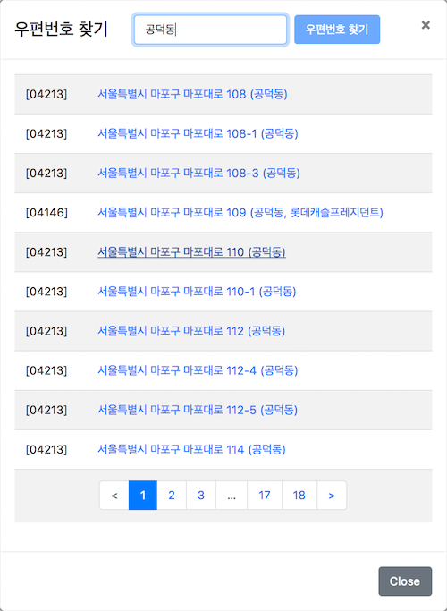

Korean Zipcode Finder
=====================

* 인터넷 우체국 제공 우편번호 찾기 API를 사용한 우편번호 찾기 gem
* https://biz.epost.go.kr/ui/index.jsp


사용법 (Usage)
-----------

* Gemfile에 추가한 후 `bundle install` 한다.

  ```ruby
  gem 'korean_zipcode_finder', '~> 0.2.1'
  ```

* 인터넷우체국에서 api_key를 신청하여 발급받음 (https://biz.epost.go.kr/ui/index.jsp)

* config/initializers/korean_zipcode_finder.rb 파일을 생성한 후 아래와 같이 `api_key` 값을 지정

    ``` ruby
    KoreanZipcodeFinder.configure do |config|
      config.api_key = "#{YOUR_API_KEY}"
    end
    ```

* 제대로 동작하는지 확인하기 위해 레일스 콘솔을 열고 아래와 같이 명령을 호출해 본다. 

  ```bash
  irb(main):001:0> KoreanZipcodeFinder.find_zipcode('공덕동')
  => [[#<struct Struct::KoreanZipcodeFinder zipcode="04213", zipcode_01="042", 
  zipcode_02="213", address="서울특별시 마포구 마포대로 108 (공덕동)", 
  original_address="서울특별시 마포구 마포대로 108 (공덕동)">, 
  #<struct Struct::KoreanZipcodeFinder zipcode="04213", zipcode_01="042", 
  zipcode_02="213", address="서울특별시 마포구 마포대로 108-1 (공덕동)", 
  original_address="서울특별시 마포구 마포대로 108-1 (공덕동)">, 
  #<struct Struct::KoreanZipcodeFinder zipcode="04213", zipcode_01="042", 
  zipcode_02="213", address="서울특별시 마포구 마포대로 108-3 (공덕동)", 
  original_address="서울특별시 마포구 마포대로 108-3 (공덕동)">, 
  #<struct Struct::KoreanZipcodeFinder zipcode="04146", zipcode_01="041", 
  zipcode_02="146", address="서울특별시 마포구 마포대로 109 (공덕동, 롯데캐슬프레지던트)", 
  original_address="서울특별시 마포구 마포대로 109 (공덕동, 롯데캐슬프레지던트)">, 
  #<struct Struct::KoreanZipcodeFinder zipcode="04213", zipcode_01="042", 
  zipcode_02="213", address="서울특별시 마포구 마포대로 110 (공덕동)", 
  original_address="서울특별시 마포구 마포대로 110 (공덕동)">, 
  #<struct Struct::KoreanZipcodeFinder zipcode="04213", zipcode_01="042", 
  zipcode_02="213", address="서울특별시 마포구 마포대로 110-1 (공덕동)", 
  original_address="서울특별시 마포구 마포대로 110-1 (공덕동)">, 
  #<struct Struct::KoreanZipcodeFinder zipcode="04213", zipcode_01="042", 
  zipcode_02="213", address="서울특별시 마포구 마포대로 112 (공덕동)", 
  original_address="서울특별시 마포구 마포대로 112 (공덕동)">, 
  #<struct Struct::KoreanZipcodeFinder zipcode="04213", zipcode_01="042", 
  zipcode_02="213", address="서울특별시 마포구 마포대로 112-4 (공덕동)", 
  original_address="서울특별시 마포구 마포대로 112-4 (공덕동)">, 
  #<struct Struct::KoreanZipcodeFinder zipcode="04213", zipcode_01="042", 
  zipcode_02="213", address="서울특별시 마포구 마포대로 112-5 (공덕동)", 
  original_address="서울특별시 마포구 마포대로 112-5 (공덕동)">, 
  #<struct Struct::KoreanZipcodeFinder zipcode="04213", zipcode_01="042", 
  zipcode_02="213", address="서울특별시 마포구 마포대로 114 (공덕동)", 
  original_address="서울특별시 마포구 마포대로 114 (공덕동)">], 
  {:totalCount=>"1775", :totalPage=>"178", :countPerPage=>"10", :currentPage=>"1"}]
  ```

Rails 5 Engine
--------------

**기본 설정**

* **application.js** 에서 아래와 같이 추가

    ``` javascript
    //= require korean_zipcode_finder/core
    ```

* **application.css** 에서 아래와 같이 추가하거나 
    ``` css
    *= require korean_zipcode_finder/core
    ```

* 또는 **application.scss** 에서 아래와 같이 추가
    ``` scss
    @import 'korean_zipcode_finder/core';
    ```


**Twitter Bootstrap v4.0.0 호환**
* **core.css** 파일은 **will_paginate** 젬을 이용한 페이징 링크에 적용할 스타일 클래스가 포함됨.

**html 마크업**

* ".address_area" 클래스를 가진 wrapper 속에 ".zipcode", ".address_01" 클래스를 가진 text_area 생성
* ".find_zipcode_btn" 클래스를 가진 "우편번호 찾기" 링크를 추가

  

  ``` html
  <div class="address_area">
    <div class='form-group'>
      <%= f.label :zipcode %><br />
      <input type='text' name='admin_training_center[zipcode]' id='admin_training_center_zipcode' class='zipcode form-control col-3 col-sm-2 col-md-1 d-inline' value="<%= f.object.zipcode %>" placeholder='99999'>
      <%= link_to '우편번호 찾기', '#', :class => "find_zipcode_btn btn btn-primary ml-2" %>
    </div>
    <%= f.label :address %><br />
    <div class='row'>
      <div class='col-6'>
        <%= f.input :address_01, label: false, placeholder: '메인주소', input_html: {class: "address_01"} %>
      </div>
      <div class='col-6'>
        <%= f.input :address_02, label: false, placeholder: '상세주소', input_html: {class: "address_02"} %>
      </div>
    </div>
  </div>
    ```
    

**적용하기**

자바스크립트 파일에서 아래와 같이 호출하면 됨.

``` javascript
new KoreanZipcodeFinder;
``` 

